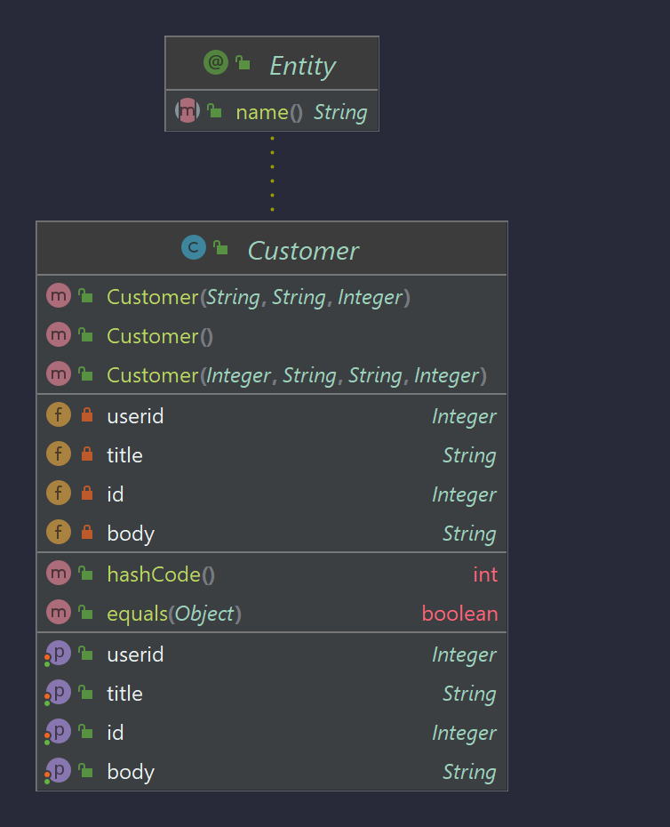

# Guides
A continuación se brindaran unos conceptos para entender lo trabajado:
### Customer
Se comienza creando la clase **Customer** la cual será usada para la implementación de listas y salidas de 

 

